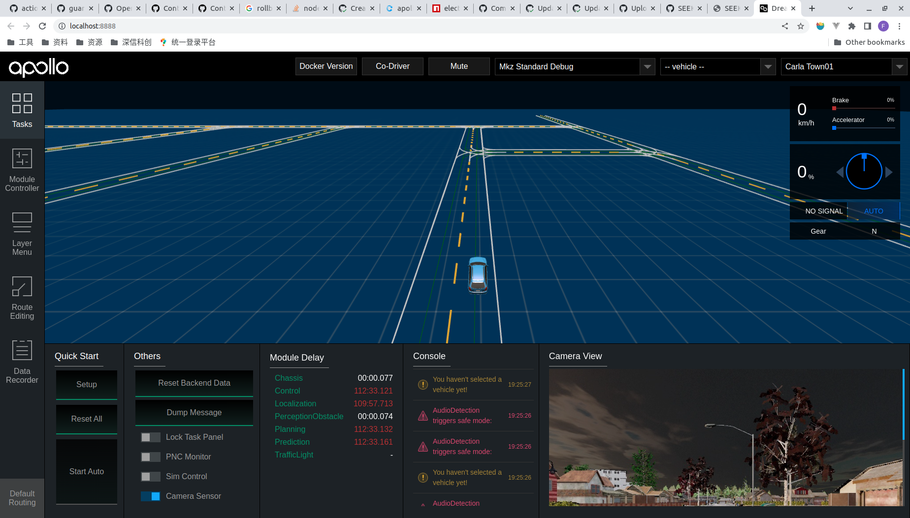
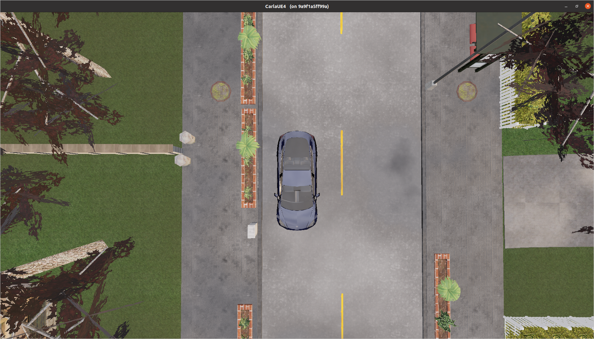

<a name="readme-top"></a>


<!-- PROJECT LOGO -->
<br />
<div align="center">
  <!-- <a href="https://github.com/othneildrew/Best-README-Template">
    
  </a> -->

  <h1 align="center">Carla Apollo Bridge</h1>
  <p align="center">
    <b>Carla & Apollo Co-simulation</b>
    <!-- <br /> -->
    <!-- <a href="https://github.com/othneildrew/Best-README-Template"><strong>Explore the docs »</strong></a>
    <br /> -->
    <br />
    <a href="https://github.com/guardstrikelab/apollo_carla">View Demo</a>
    ·
    <a href="https://github.com/guardstrikelab/apollo_carla/issues">Report Bug</a>
    ·
    <a href="https://github.com/guardstrikelab/apollo_carla/pulls">Request Feature</a>
    <br>
  </p>
</div>


<!-- TABLE OF CONTENTS -->
<!-- <details>
  <summary>Table of Contents</summary>
  <ol>
    <li>
      <a href="#about-the-project">About Carla Apollo Bridge</a>
      <ul>
        <li><a href="#built-with">Built With</a></li>
      </ul>
    </li>
    <li>
      <a href="#getting-started">Getting Started</a>
      <ul>
        <li><a href="#prerequisites">Prerequisites</a></li>
        <li><a href="#installation">Installation</a></li>
      </ul>
    </li>
    <li><a href="#usage">Usage</a></li>
    <li><a href="#roadmap">Roadmap</a></li>
    <li><a href="#contributing">Contributing</a></li>
    <li><a href="#license">License</a></li>
    <li><a href="#contact">Contact</a></li>
    <li><a href="#acknowledgments">Acknowledgments</a></li>
  </ol>
</details> -->


[](https://www.tickgit.com/browse?repo=github.com/guardstrikelab/carla_apollo_bridge)


[](https://github.com/guardstrikelab/carla_apollo_bridge/blob/master/LICENSE)


<!-- ABOUT THE PROJECT -->
## About
This project aims to provide a data and control bridge for the communication between Carla and Apollo. It was tested with Carla 0.9.14 and the Apollo [master branch](https://github.com/ApolloAuto/apollo/commit/aa0c5eb66189b86a724206305712cfb337c07619) (newer than v7.0.0)


<!-- GETTING STARTED -->
## Getting Started

### Prerequisites

We will run Carla and Apollo in docker. Furthermore, NVIDIA Container Toolkit is needed. You can refer to the following link to install NVIDIA Container Toolkit:
* https://docs.nvidia.com/datacenter/cloud-native/container-toolkit/install-guide.html

Alternatively, simply perform the following steps：

* docker

  ```sh
  sudo apt-get install docker.io
  ```
* NVIDIA Container Toolkit

  ```sh
  curl https://get.docker.com | sh \
  && sudo systemctl --now enable docker
  ```
  ```sh
  distribution=$(. /etc/os-release;echo $ID$VERSION_ID) \
      && curl -fsSL https://nvidia.github.io/libnvidia-container/gpgkey | sudo gpg --dearmor -o /usr/share/keyrings/nvidia-container-toolkit-keyring.gpg \
      && curl -s -L https://nvidia.github.io/libnvidia-container/$distribution/libnvidia-container.list | \
            sed 's#deb https://#deb [signed-by=/usr/share/keyrings/nvidia-container-toolkit-keyring.gpg] https://#g' | \
            sudo tee /etc/apt/sources.list.d/nvidia-container-toolkit.list
  ```
  ```sh
  sudo apt-get update
  ```
  ```sh
  sudo apt-get install -y nvidia-docker2
  ```
  ```sh
  sudo systemctl restart docker
  ```

### Build And Run Apollo

* Refer to this link：
  <br> https://github.com/ApolloAuto/apollo/blob/master/docs/01_Installation%20Instructions/apollo_software_installation_guide.md

1. We patched Apollo in order to work with our bridge, for now please use the guardstrike/apollo_carla_bridge branch from our fork. 

   ```sh
   # Using SSH
   git clone --branch guardstrike/apollo_carla_bridge git@github.com:guardstrikelab/apollo.git
   
   #Using HTTPS
   git clone --branch guardstrike/apollo_carla_bridge https://github.com/guardstrikelab/apollo.git
   ```

   We will be sending this patch upstream soon so that you can just clone the official Apollo next time.

2. Build Apollo
   
   ```sh
   cd apollo
   echo "export APOLLO_ROOT_DIR=$(pwd)" >> ~/.bashrc  && source ~/.bashrc
   ```

   Then, run:

   ```sh
   bash docker/scripts/dev_start.sh
   ```

   to start Apollo development docker container.
   <br>If you encounter any error, try

   ```sh
   sudo rm -rf /apollo/.cache
   bash docker/scripts/dev_start.sh
   ```

   Upon successful execution, you will see the following message

   ```sh
   [ OK ] Congratulations! You have successfully finished setting up Apollo Dev Environment.
   [ OK ] To login into the newly created apollo_dev_lei container, please run the following command:
   [ OK ]   bash docker/scripts/dev_into.sh
   [ OK ] Enjoy!
   ```
   > Above If you occured error as "ERROR: Config value 'cuda' is not defined in any .rc file",you can try 

   ```sh
   ./apollo.sh config -n
   ```

   Run this command to enter the container

   ```sh
   bash docker/scripts/dev_into.sh
   ```

   Make the GPU version:

   ```sh
   ./apollo.sh build_gpu
   ```

   After successful compilation, the following will be printed:

   ```sh
   ==============================================
   [ OK ] Done building apollo. Enjoy!
   ==============================================
   ```

   Run this command in the container to start Dreamview

   ```sh
   ./scripts/bootstrap.sh
   ```

   Finally, open the link in your browser

   ```sh
   http://localhost:8888/
   ```
### Run Carla

* Clone the carla_apollo_bridge project

  ```sh
  # Using SSH
  git clone git@github.com:guardstrikelab/carla_apollo_bridge.git
  
  #Using HTTPS
  git clone https://github.com/guardstrikelab/carla_apollo_bridge.git
  ```

* To download and install Compose standalone, run:

```
     sudo curl -L "https://github.com/docker/compose/releases/download/v2.0.1/docker-compose-$(uname -s)-$(uname -m)" -o /usr/local/bin/docker-compose
```

* Change File Permission:

  ``` sh
  sudo chmod +x /usr/local/bin/docker-compose 
  ```

> Apply executable permissions to the standalone binary in the target path for the installation.
> Test and execute compose commands using docker-compose.
> **Note:**
> If the command docker-compose fails after installation, check your path. You can also create a symbolic link to /usr/bin or any other directory in your path. For example:

```sh
 sudo ln -s /usr/local/bin/docker-compose /usr/bin/docker-compose
```

* Pull carla image and run

  ```sh
  cd carla_apollo_bridge/scripts
  ./docker_run_carla.sh
  ```


<!-- USAGE EXAMPLES -->
### Run carla_apollo_bridge
1.  Run the following to enter the container. Note that `carla_apollo_bridge/src` is mapped to `/apollo/cyber/carla_bridge` within the container, this allows you to test any change you make to the bridge. 
    ```sh
    cd carla_apollo_bridge/docker
    ./build_docker.sh
    ./run_docker.sh
    docker exec -ti carla_cyber_0.9.14 bash
    ```
2.  Compile

    Run the following command in the container
    ```sh
    ./apollo.sh build_cyber opt
    ```
    The following information is displayed after the compilation is successful:
    ```sh
    [INFO] Skipping revision recording
    ============================
    [ OK ] Build passed!
    [INFO] Took 61 seconds
    ```
3. Start the bridge and spawn the ego vehicle

    Run the following command in the container.
    ```sh
    cd /apollo/cyber/carla_bridge
    python carla_cyber_bridge/bridge.py
    ```
    Start a new terminal and run:
    ```sh
    docker exec -ti carla_cyber_0.9.14 bash
    cd /apollo/cyber/carla_bridge
    python carla_spawn_objects/carla_spawn_objects.py
    ```

### Result
If everything above goes well, you should see this in Apollo client: 
 


and this in Carla:




## Example: start a co-simulation
1. Open apollo client: http://localhost:8888
2. (Optional) Select "Task" in the sidebar and turn on "Camera Sensor" in "Others".
3. (Optional) Select "Layer Menu" in the sidebar and turn on "Point Cloud" in "Perception".
4. Select "Module Controller" in the sidebar and turn on "Routing" module.
5. Select "Route Editing" in the sidebar.
6. Click "Add Point of Interest" and left click at any point on the road to set the destination.
7. Click "Send Routing Request".
8. Select "Tasks" and click "Setup" to start co-simulation.


## More
[Deployment Network Introduction](./docs/deployment_introduction.md)
<!-- ROADMAP -->
<!-- ## Roadmap
- [ ] Add Additional Templates w/ Examples
- [ ] Add "components" document to easily copy & paste sections of the readme
- [ ] Multi-language Support
    - [ ] Chinese
    - [ ] Spanish

See the [open issues](https://github.com/othneildrew/Best-README-Template/issues) for a full list of proposed features (and known issues). -->


<!-- CONTRIBUTING -->
## Contribution

Contributions are what make the open source community such an amazing place to learn, inspire, and create. Any contribution you make is **greatly appreciated**.

If you have a suggestion that would make this better, please fork the repo and create a pull request. You can also simply open an issue with the tag "enhancement".
Don't forget to give the project a star! Thanks again!

1. Fork the Project
2. Create your Feature Branch (`git checkout -b feature/AmazingFeature`)
3. Commit your Changes (`git commit -m 'Add some AmazingFeature'`)
4. Push to the Branch (`git push origin feature/AmazingFeature`)
5. Open a Pull Request


<!-- LICENSE -->
## License

Distributed under the Apache-2.0 License. See `LICENSE` for more information.


<!-- CONTACT -->
<!-- ## Contact

Your Name - [@your_twitter](https://twitter.com/your_username) - email@example.com

Project Link: [https://github.com/your_username/repo_name](https://github.com/your_username/repo_name) -->


<!-- ACKNOWLEDGMENTS -->
## Acknowledgments

This work is based on the following open-source projects:

* [Apollo](https://github.com/ApolloAuto/apollo)
* [Carla Apollo Bridge](https://github.com/AuroAi/carla_apollo_bridge)
* [Carla Apollo](https://github.com/casper-auto/carla-apollo)

<p align="right">(<a href="#readme-top">back to top</a>)</p>


